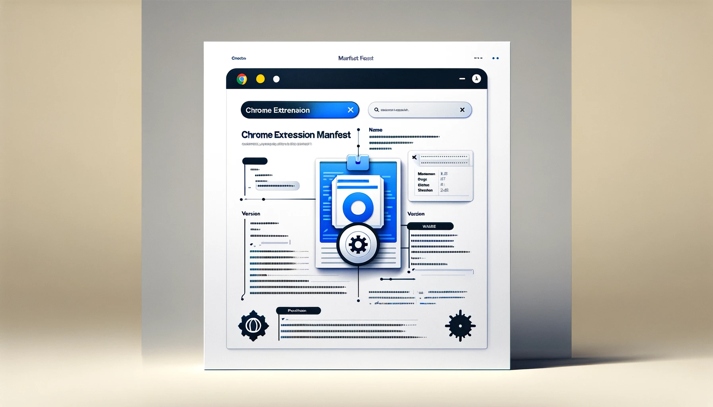

## Chrome Extension Pentest Toolkit

---

### Who am i

<small>
Ik ben Thor, een student Cyber Security aan Howest.
</small>

note: en in mijn vrije tijd probeer ik te pentesten

---

### Automatiseren van pentesten

<small>Kan ik dit niet automatiseren</small>

---

##### General info gathering

note: general info krijgen

---

##### Path Traversal

note: Path traversal vulnerabilities occur when input values (such as file paths) provided by a user are not properly sanitized, allowing attackers to navigate the server’s directory structure. An example is input like "../../../../../etc/passwd" which can lead to unauthorized access to critical system files

---

### Who knows what an extension is???

---

### What extensions actually are

<small>
Javascript scripts that extend a browser.
</small>

---

### Why I Started Developing a Chrome Extension

<small>
It all began with the documents on leho.
</small>

note: my frustration at school, specifically with the cumbersome process of viewing documents on leho. I had to scroll three times just to see a single page in its entirety.

note: This led me to write a small piece of JavaScript and execute it in the console. Later, I evolved this script into a bookmarklet. However, I still found it inconvenient to open a document and press the bookmark each time. Thus, I embarked on a quest to find a way to automatically execute JavaScript whenever a leho document was opened. This journey led me to the world of browser extensions.

note: Although there were existing extensions like Tampermonkey that could potentially meet my needs, they didn't perform exactly as I wanted it. They were either too complex for my simple requirements or failed to function in the desired manner. As a result, I decided to develop my own extension.

---

### Why a chrome extension?

note: The biggest reason: chrome is my default browser.
note: Afterwards, when thinking more about it: the chrome browser itself has a market share of ~65%, safari ~15% (but i don't have a MacBook so this wouldn't be feasible), firefox ~5% and the last ~15% are the other browsers and a lot of those are chromium based.

note: Although initially i tried to develop the extensions for both Firefox and Chromium-based browsers i found Google's documentation to be superior. Furthermore, after spending hours trying to make it work on Firefox without success, I decided to focus on Chromium-based browsers, which also offered the advantage of wider applicability due to their increasing market share.

---

### Development process

<small>
XML => modularizing => separate files => organized
</small>

note: The first automatic exploit I worked on involved an XML attack, which I learned about from an article. After successfully implementing this exploit, I took the time to modularize my code, breaking it down into separate files and folders for better organization and maintenance. This also enabled me to add a "module" to insert new exploits when they got developed

---

#### Key Components of the Extension

<small>
Before i start explaining the exploits
</small>

note: there are some things we need to get familiar with:

---

dit op diagram zetten

##### manifest.json

note: This is the brains and puts the following parts together.

##### background.js
note: This is accesses the whole browser.

##### content.js

note: This can access a tab.

##### offscreen.html/js

note: This file is a document loaded without seeing it, and can do some things the content can't do.

##### popup.html/js

note: This is the interface you see when you click the extension's icon, where the results for the current tab are displayed.

##### options.html/js

note: In this section, we configure settings, primarily filters for results and URLs to ignore during a penetration test.

#### Issues

Scope & Showing results

---

##### Javascript Scope

note: During the development process, I encountered multiple challenges related to the scope of JavaScript variables and methods, as well as storage.

note: As depicted, the structure is complex, but I will simplify it:

---

<small>
background.js => whole browser
</small> 
<small>
content.js => individual tabs
</small>

---

<small>
offscreen.html, started from background
</small> 
<small>
popup.html and settings.html, are started when opened
</small> 

note: You have a browser which is interacted with via background.js. It contains tabs that are managed through content.js.
note: Each of these components has its own scope and communicates with others via post messages.
note: - Additionally, an offscreen HTML page is started up, loaded from the background, and has its own scope.
note: Popup and settings pages also have their own scopes and are reloaded each time they are opened, so they don't need to directly share data (except for stored data).

---

###### Exceptions

<small>
Content.js isn't a module
</small>

 

note: which allows the use of the import method.
note: This is useful for separating different functions into different files.

note: Then, regarding the storage scope:

note: - While implementing localStorage and cookies is straightforward, they can only be accessed from content.js.
note: - We needed storage that could be accessed from each part of the extension. Therefore, I opted for IndexedDB. Although relatively slow, it gets the job done.

---

##### Results

<small>
Console.log => popup
</small>

 

note: Initially, I always opened the extension’s development console and logged each response. While this is easy and fast for checking functionality during development, it is not suitable for the final product. Therefore, I explored methods to save the results and subsequently needed to determine how to display them. In the end, I decided to store them in IndexedDB and display the results of the current page when clicking the extension's icon

---

### How it works

<small>
Visit site => click around => if footprint detected -> try exploit -> if succeeded notification -> view results in popup
</small>

note:Generally, here's how the process works: When you visit a webpage and engage in activities like clicking buttons or other interactions, the extension detects specific identifiers or "footprints." If it recognizes any, and there are associated payloads, it sends these to an offscreen document. In this offscreen document, the extension tests the payloads, and then filters the results, which can be adjusted in the settings. Subsequently, the filtered results are stored in the IndexedDB, organized by the tab they originated from. Additionally, if there are any successful results, a counter is displayed on the extension's icon in the taskbar, also tab-specific

---

#### Honorable mentions

<small>
- Koen Koreman
</small>  
<small>
- Tobias Chielens
</small>  
<small>
- Matthias Blomme
</small>

---

##### Thanks for listening
