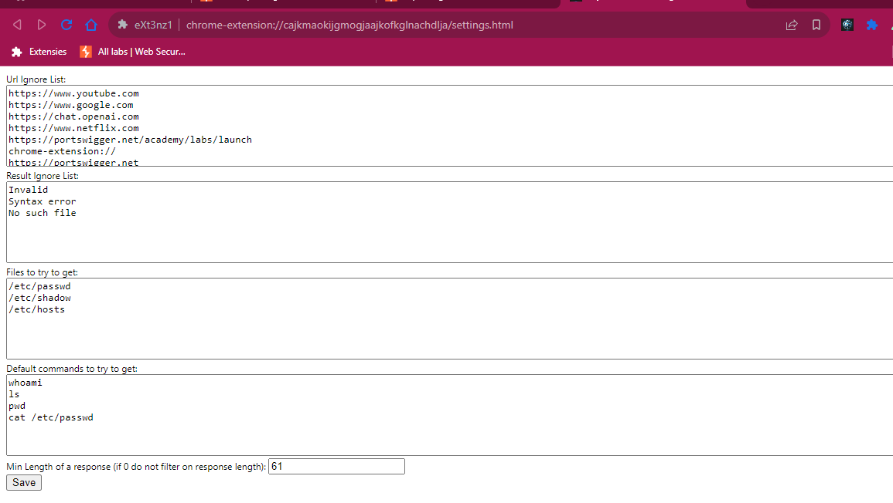

## Chrome Extension Pentest Toolkit

<small>
This repository contains a Chrome extension that facilitates the demonstration and testing of various web security exploits.
</small>

---

### Who am i

<small>
I'm Thor, a cybersecurity student at Howest studying Applied Computer Science.
</small>

---

### Disclaimer

<small>
This Chrome extension and associated exploits are intended for educational and testing purposes only. Do not use these exploits on any system or website without proper authorization. The developers and contributors of this repository are not responsible for any misuse or damage caused by these exploits. Always ensure that you have appropriate permissions before conducting any security testing.
</small>

---

### Who knows what an extension is???

---

### What extensions actually are

<small>
Extensions are JavaScript programs that run either in the background or within the same execution environment as a webpage.
</small>

---

### Why I Started Developing a Chrome Extension

<small>
It all began with the documents on leho.
</small>

note: my frustration at school, specifically with the cumbersome process of viewing documents on leho. I had to scroll three times just to see a single page in its entirety.

note: This led me to write a small piece of JavaScript and execute it in the console. Later, I evolved this script into a bookmarklet. However, I still found it inconvenient to open a document and press the bookmark each time. Thus, I embarked on a quest to find a way to automatically execute JavaScript whenever a leho document was opened. This journey led me to the world of browser extensions.

note: Although there were existing extensions like Tampermonkey that could potentially meet my needs, they didn't perform exactly as I wanted it. They were either too complex for my simple requirements or failed to function in the desired manner. As a result, I decided to develop my own extension.

---

### Why a chrome extension?

note: The biggest reason: chrome is my default browser.
note: Afterwards, when thinking more about it: the chrome browser itself has a market share of ~65%, safari ~15% (but i don't have a MacBook so this wouldn't be feasible), firefox ~5% and the last ~15% are the other browsers and a lot of those are chromium based.

note: Although initially i tried to develop the extensions for both Firefox and Chromium-based browsers i found Google's documentation to be superior. Furthermore, after spending hours trying to make it work on Firefox without success, I decided to focus on Chromium-based browsers, which also offered the advantage of wider applicability due to their increasing market share.

---

### Development process

<small>
XML => modularizing => separate files => organized
</small>

note: The first automatic exploit I worked on involved an XML attack, which I learned about from an article. After successfully implementing this exploit, I took the time to modularize my code, breaking it down into separate files and folders for better organization and maintenance. This also enabled me to add a "module" to insert new exploits when they got developed

---

#### Key Components of the Extension

<small>
Before i start explaining the exploits
</small>

note: there are some things we need to get familiar with:

---

##### manifest.json

note: This file acts as the backbone of a Chrome extension. It configures the extension by declaring its major components and requesting the necessary permissions to function properly.

---

##### background.js

note: Think of this as the JavaScript that powers the entire browser extension environment. While it cannot interact directly with the content of each tab, it can intercept requests and manage broader extension activities.

---

##### offscreen.html

note: This HTML file exists within the same operational context as a browser tab but remains invisible to the user. It serves as a hidden layer where certain extension processes can run in the background.

---

##### offscreen.js

note: Associated with offscreen.html, this JavaScript file is dedicated to monitoring specific events or "attacks" within the extension's hidden realm. It is where we listen for and respond to various triggers.

---

##### content.js

note: This script runs in the context of each browser tab, directly interacting with the web content. It is isolated to the tab it operates in, ensuring that its actions are tab-specific and do not interfere with the broader browser or other tabs.

---

##### popup.html/js

note: This is the interface you see when you click the extension's icon, where the results for the current tab are displayed.

---

##### settings.html/js (previously options.html/js)

note: In this section, we configure settings, primarily filters for results and URLs to ignore during a penetration test.

---

#### Issues

Scope & Showing results

---

##### Javascript Scope

note: During the development process, I encountered multiple challenges related to the scope of JavaScript variables and methods, as well as storage.

note: As depicted, the structure is complex, but I will simplify it:

---

<small>
background.js => whole browser
</small> 
<small>
content.js => individual tabs
</small>

---

<small>
offscreen.html, started from background
</small> 
<small>
popup.html and settings.html, are started when opened
</small> 

note: You have a browser which is interacted with via background.js. It contains tabs that are managed through content.js.
note: Each of these components has its own scope and communicates with others via post messages.
note: - Additionally, an offscreen HTML page is started up, loaded from the background, and has its own scope.
note: Popup and settings pages also have their own scopes and are reloaded each time they are opened, so they don't need to directly share data (except for stored data).

---

###### Exceptions

<small>
Content.js isn't a module
</small>

note: which allows the use of the import method.
note: This is useful for separating different functions into different files.

note: Then, regarding the storage scope:

note: - While implementing localStorage and cookies is straightforward, they can only be accessed from content.js.
note: - We needed storage that could be accessed from each part of the extension. Therefore, I opted for IndexedDB. Although relatively slow, it gets the job done.

---

##### Results

<small>
Console.log => popup
</small>

note: Initially, I always opened the extension’s development console and logged each response. While this is easy and fast for checking functionality during development, it is not suitable for the final product. Therefore, I explored methods to save the results and subsequently needed to determine how to display them. In the end, I decided to store them in IndexedDB and display the results of the current page when clicking the extension's icon

---

#### Tools and Methodology

note: There where also tools, that i used, to debug, to understand, to explore the internet:

---

<small>
Burp Suite
</small>

note: For examining and modifying requests, I utilized Burp Suite by Dafydd Stuttard, a tool that lets you intercept, view, and modify the requests sent from your browser. My approach involved intercepting every request using background JavaScript. This method allowed for real-time monitoring and modification of requests before they were completed, offering insights into potential exploits.

---

##### Chrome DevTools

<small>
ctrl + shift + i
</small>

note: This integrated set of tools is built directly into the Google Chrome browser, allowing developers to edit pages on-the-fly and diagnose problems quickly, which helps in understanding the detailed workings of web applications. I used Chrome DevTools extensively for inspecting HTML, CSS, and JavaScript, observing network activity, and managing browser storage among other things

---

<small>
Google Documentation
</small>

note:Google's comprehensive documentation resources were invaluable for understanding best practices and how to effectively use various APIs and services. I frequently referred to Google's developer documentation to ensure that I was using the most up-to-date and efficient methods available.

---

<small>
ChatGPT
</small>

note:For synthesizing information, explaining complex concepts in simpler terms, spellchecking, and generating images, I used ChatGPT. It was particularly helpful not only for quick summaries and clarifications on technical topics but also for creating visual content that aided in illustrating points and enhancing presentations. The ability to generate images helped in visualizing concepts that were otherwise abstract and difficult to convey through text alone.

---

### exploits

<small>
Visit site => click around => if detected -> try exploit -> if succeeded notification -> view results in popup
</small>

note:Generally, here's how the process works: When you visit a webpage and engage in activities like clicking buttons or other interactions, the extension detects specific identifiers or "footprints." If it recognizes any, and there are associated payloads, it sends these to an offscreen document. In this offscreen document, the extension tests the payloads, and then filters the results, which can be adjusted in the settings. Subsequently, the filtered results are stored in the IndexedDB, organized by the tab they originated from. Additionally, if there are any successful results, a counter is displayed on the extension's icon in the taskbar, also tab-specific

---

##### XInclude Attacks

note: attacks occur when XML parsers on the server-side process input that includes XInclude statements. By default, XInclude attempts to parse included documents as XML. However, attackers can exploit this feature to include non-XML files such as "/etc/passwd" by specifying the parsing method as text. This vulnerability allows unauthorized file access through crafted XML input

---

##### XML External Entity (XXE) Injection

note: XXE injection involves exploiting the feature in XML where external entities can be defined and used within the document. When XML input containing external entity declarations is processed, it can be manipulated to include data from system files like "file:///etc/passwd". This type of attack can lead to data exposure or retrieval of sensitive files.

---

##### Path Traversal

note: Path traversal vulnerabilities occur when input values (such as file paths) provided by a user are not properly sanitized, allowing attackers to navigate the server’s directory structure. An example is input like "../../../../../etc/passwd" which can lead to unauthorized access to critical system files

---

##### PostMessage Identifying

note: The postMessage method is typically used in web applications to enable secure communication between windows or frames from different origins. However, if not properly implemented, it can be vulnerable to attacks. Malicious scripts can exploit postMessage to execute unauthorized actions or access sensitive data. Identifying and mitigating these vulnerabilities requires careful scrutiny of how messages are validated and handled within the application

---

#### Example demo video

note: For now, you can visit websites and freely explore their features. If the extension detects a request that might be exploitable, it will automatically attempt certain actions. You can view the results in the extension's service.

---

#### Honorable mentions

<small>
- Koen Koreman
</small>  

note: The man, the myth, the legend, himself. Someone i look up to, one of the best docents i've ever had.

<small>
- Tobias Chielens
</small>  

note:For the interesting internship.

<small>
- Matthias Blomme
</small>

---

##### Thanks for listening
