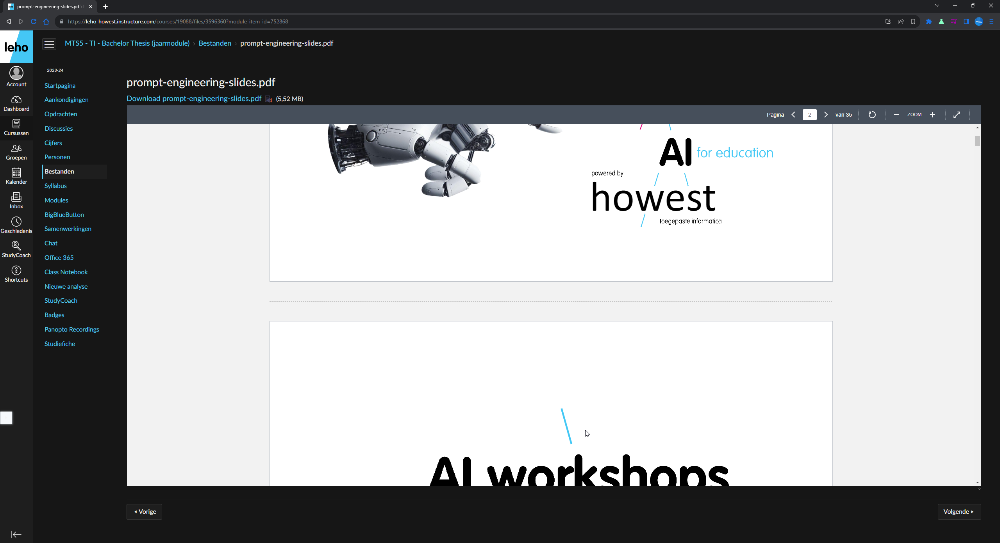

# Chrome Extension Webpentesting Framework

Door Thor.

---

## Idee

<small>
Kan ik webpentesting meer automatiseren in Chrome?
</small>

note: in men chrome browser
note: --- erin want ik zet niet supergraag superveel open
note: ik gebruik al veel extensies,
note: dus wat als ik zelf een extension maak die meerdere exploits automatisch uitvoert

---

note: use case

---

---

## Wie weet wat extensies zijn?

---

## Wie weet wat extensies zijn?

<small>Dit zijn javascript scripts die uw browser uitbreiden</small>

---

## Hoe het begon -- Leho

note: het begon met leho je kan hier documenten op zien
note: maar deze worden vaak maar voor de helft getoond op een klein scherm

---

note: dus in het eerste jaar schreef ik hier al een bookmarklet
note: maar hier moest ik dan iedere keer op klikken als ik een nieuw document opende
note: hierna hing ik opzoek naar hoe ik dit automatisch kon doen en toen kwam ik in de wereld van extensies

---

## Hoe zitten extensies in elkaar

note: deze kunnen allemaal js modules zijn buiten de content
note: probleem van de scopes uitleggen
note: probleem met storage

---

## XML

note: eerst maakte ik een xml inclusion attack 

---

## Modularize

note: hierna modularizeerde ik mijn code, tot nu toe had ik alles en 1 bestand
note: maar dit was niet haalbaar om naar meerdere exploits uit te breiden
note: dus maakte ik een "listener"
note: deze hadden de functie om te "luisteren" off er op een site een exploit mogelijk was, en dan een exploit uit te voeren

---

## Results

note: eerst developte ik zo:

---

---

note: en hierna maakte ik het popup scherm
note: zodat je gemakkelijk de resultaten kan zien

---

### QUESTIONS?

---

### Thanks
